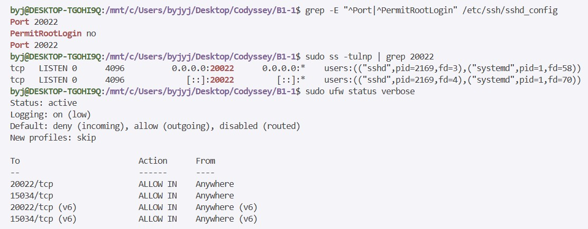
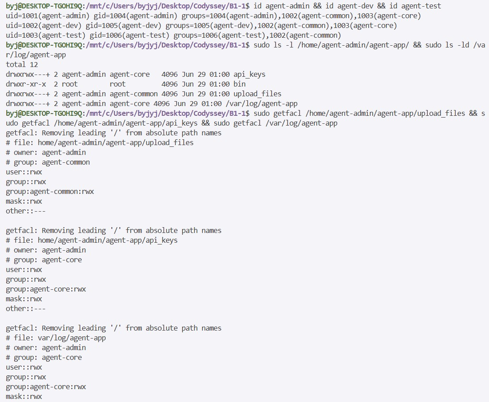
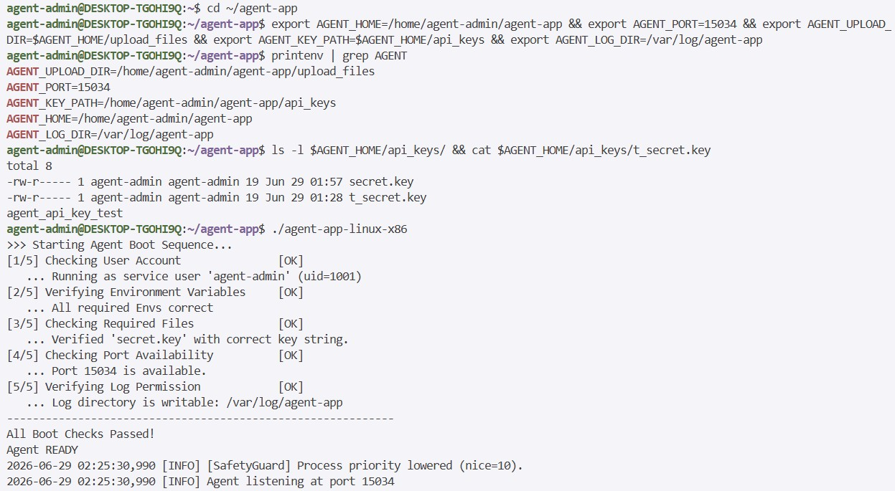
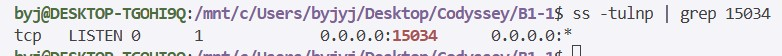
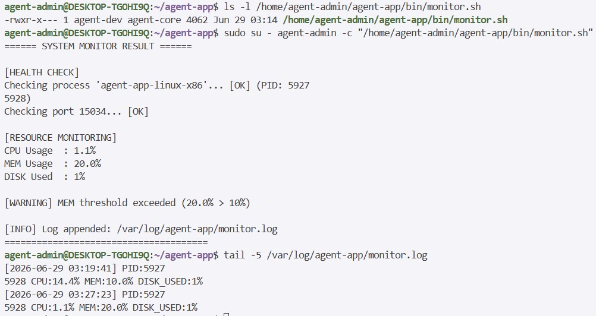
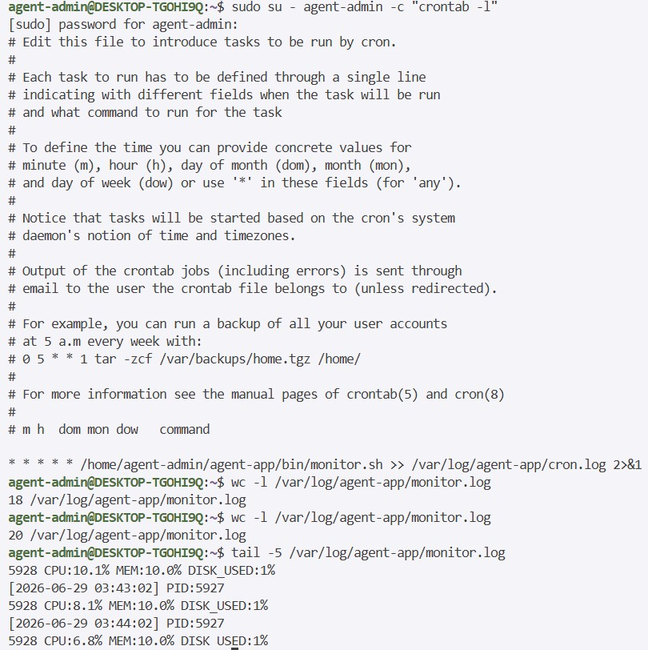

# Phase 6. 수행 내역서 작성 (증거 자료 수집 완료)

> **목표**: 과제 전 단계에서 수집한 증거 자료(스크린샷 및 실제 터미널 출력)를 정리하여 최종 제출용 수행 내역서를 완성합니다.

---

## 1. SSH 포트 변경 및 Root 원격 접속 차단 확인 (체크리스트 1)

### 수집 명령어
```bash
# sshd_config 설정값 확인
grep -E "^Port|^PermitRootLogin" /etc/ssh/sshd_config

# sshd가 20022 포트에서 LISTEN 중인지 확인
sudo ss -tulnp | grep sshd
```

### 기대 출력
```
Port 20022
PermitRootLogin no

tcp  LISTEN 0  128  0.0.0.0:20022  0.0.0.0:*  users:(("sshd",...))
```

### 실제 실행 결과 및 증거 자료


**실제 실행 콘솔 출력**:
```bash
byj@DESKTOP-TGOHI9Q:/mnt/c/Users/byjyj/Desktop/Codyssey/B1-1$ grep -E "^Port|^PermitRootLogin" /etc/ssh/sshd_config
Port 20022
PermitRootLogin no
Port 20022

byj@DESKTOP-TGOHI9Q:/mnt/c/Users/byjyj/Desktop/Codyssey/B1-1$ sudo ss -tulnp | grep 20022
tcp   LISTEN 0      4096         0.0.0.0:20022      0.0.0.0:*      users:(("sshd",pid=2169,fd=3),("systemd",pid=1,fd=58))
tcp   LISTEN 0      4096            [::]:20022         [::]:*      users:(("sshd",pid=2169,fd=4),("systemd",pid=1,fd=70))
```

---

## 2. 방화벽 활성화 및 허용 포트 확인 (체크리스트 2)

### 수집 명령어
```bash
sudo ufw status verbose
```

### 기대 출력
```
Status: active
...
To                         Action      From
--                         ------      ----
20022/tcp                  ALLOW IN    Anywhere
15034/tcp                  ALLOW IN    Anywhere
```

### 실제 실행 결과 및 증거 자료


**실제 실행 콘솔 출력**:
```bash
byj@DESKTOP-TGOHI9Q:/mnt/c/Users/byjyj/Desktop/Codyssey/B1-1$ sudo ufw status verbose
Status: active
Logging: on (low)
Default: deny (incoming), allow (outgoing), disabled (routed)
New profiles: skip

To                         Action      From
--                         ------      ----
20022/tcp                  ALLOW IN    Anywhere                  
15034/tcp                  ALLOW IN    Anywhere                  
20022/tcp (v6)             ALLOW IN    Anywhere (v6)             
15034/tcp (v6)             ALLOW IN    Anywhere (v6)             
```

---

## 3. 계정 및 그룹 생성 확인 (체크리스트 3)

### 수집 명령어
```bash
id agent-admin
id agent-dev
id agent-test
```

### 기대 출력
```
uid=...(agent-admin) ... groups=...,agent-common,agent-core
uid=...(agent-dev)   ... groups=...,agent-common,agent-core
uid=...(agent-test)  ... groups=...,agent-common
```

### 실제 실행 결과 및 증거 자료


**실제 실행 콘솔 출력**:
```bash
byj@DESKTOP-TGOHI9Q:/mnt/c/Users/byjyj/Desktop/Codyssey/B1-1$ id agent-admin && id agent-dev && id agent-test
uid=1001(agent-admin) gid=1004(agent-admin) groups=1004(agent-admin),1002(agent-common),1003(agent-core)
uid=1002(agent-dev) gid=1005(agent-dev) groups=1005(agent-dev),1002(agent-common),1003(agent-core)
uid=1003(agent-test) gid=1006(agent-test) groups=1006(agent-test),1002(agent-common)
```

---

## 4. 디렉토리 구조 및 권한(ACL) 확인 (체크리스트 4)

### 수집 명령어
```bash
# 디렉토리 목록 및 기본 권한
ls -l /home/agent-admin/agent-app/
ls -ld /var/log/agent-app

# ACL 상세 확인
getfacl /home/agent-admin/agent-app/upload_files
getfacl /home/agent-admin/agent-app/api_keys
getfacl /var/log/agent-app
```

### 실제 실행 결과 및 증거 자료


**실제 실행 콘솔 출력**:
```bash
byj@DESKTOP-TGOHI9Q:/mnt/c/Users/byjyj/Desktop/Codyssey/B1-1$ sudo ls -l /home/agent-admin/agent-app/ && sudo ls -ld /var/log/agent-app
total 12
drwxrwx---+ 2 agent-admin agent-core   4096 Jun 29 01:00 api_keys
drwxr-xr-x  2 root        root         4096 Jun 29 01:00 bin
drwxrwx---+ 2 agent-admin agent-common 4096 Jun 29 01:00 upload_files
drwxrwx---+ 2 agent-admin agent-core   4096 Jun 29 01:00 /var/log/agent-app

byj@DESKTOP-TGOHI9Q:/mnt/c/Users/byjyj/Desktop/Codyssey/B1-1$ sudo getfacl /home/agent-admin/agent-app/upload_files && sudo getfacl /home/agent-admin/agent-app/api_keys && sudo getfacl /var/log/agent-app
getfacl: Removing leading '/' from absolute path names
# file: home/agent-admin/agent-app/upload_files
# owner: agent-admin
# group: agent-common
user::rwx
group::rwx
group:agent-common:rwx
mask::rwx
other::---

getfacl: Removing leading '/' from absolute path names
# file: home/agent-admin/agent-app/api_keys
# owner: agent-admin
# group: agent-core
user::rwx
group::rwx
group:agent-core:rwx
mask::rwx
other::---

getfacl: Removing leading '/' from absolute path names
# file: var/log/agent-app
# owner: agent-admin
# group: agent-core
user::rwx
group::rwx
group:agent-core:rwx
mask::rwx
other::---
```

---

## 5. 앱 Boot Sequence 5단계 [OK] 및 "Agent READY" 출력 (체크리스트 5)

### 수집 방법
앱을 `agent-admin` 계정으로 실행하여 콘솔 출력 전체를 캡처하고, 포트 리스닝 상태도 확인합니다:
```bash
sudo su - agent-admin
cd $AGENT_HOME
./agent-app-linux-x86
```

### 기대 출력
```
Starting Agent Boot Sequence...
[1/5] Checking User Account               [OK]
... Running as service user 'agent-admin' (uid=...)
[2/5] Verifying Environment Variables     [OK]
... All required Envs correct
[3/5] Checking Required Files             [OK]
... Verified key file with correct key string.
[4/5] Checking Port Availability          [OK]
... Port 15034 is available.
[5/5] Verifying Log Permission            [OK]
... Log directory is writable: /var/log/agent-app
------------------------------------------------------------
All Boot Checks Passed!
Agent READY
```

### 실제 실행 결과 및 증거 자료



**실제 실행 콘솔 출력 (환경변수 및 Boot Sequence 확인)**:
```bash
agent-admin@DESKTOP-TGOHI9Q:~$ cd ~/agent-app
agent-admin@DESKTOP-TGOHI9Q:~/agent-app$ export AGENT_HOME=/home/agent-admin/agent-app && export AGENT_PORT=15034 && export AGENT_UPLOAD_DIR=$AGENT_HOME/upload_files && export AGENT_KEY_PATH=$AGENT_HOME/api_keys && export AGENT_LOG_DIR=/var/log/agent-app
agent-admin@DESKTOP-TGOHI9Q:~/agent-app$ printenv | grep AGENT
AGENT_UPLOAD_DIR=/home/agent-admin/agent-app/upload_files
AGENT_PORT=15034
AGENT_KEY_PATH=/home/agent-admin/agent-app/api_keys
AGENT_HOME=/home/agent-admin/agent-app
AGENT_LOG_DIR=/var/log/agent-app

agent-admin@DESKTOP-TGOHI9Q:~/agent-app$ ls -l $AGENT_HOME/api_keys/ && cat $AGENT_HOME/api_keys/t_secret.key
total 8
-rw-r----- 1 agent-admin agent-admin 19 Jun 29 01:57 secret.key
-rw-r----- 1 agent-admin agent-admin 19 Jun 29 01:28 t_secret.key
agent_api_key_test

agent-admin@DESKTOP-TGOHI9Q:~/agent-app$ ./agent-app-linux-x86
>>> Starting Agent Boot Sequence...
[1/5] Checking User Account          [OK]
  ... Running as service user 'agent-admin' (uid=1001)
[2/5] Verifying Environment Variables [OK]
  ... All required Envs correct
[3/5] Checking Required Files        [OK]
  ... Verified 'secret.key' with correct key string.
[4/5] Checking Port Availability     [OK]
  ... Port 15034 is available.
[5/5] Verifying Log Permission       [OK]
  ... Log directory is writable: /var/log/agent-app
------------------------------------------------------
All Boot Checks Passed!
Agent READY
2026-06-29 02:25:30,990 [INFO] [SafetyGuard] Process priority lowered (nice=10).
2026-06-29 02:25:30,990 [INFO] Agent listening at port 15034
```

**포트 리스닝 확인**:
```bash
byj@DESKTOP-TGOHI9Q:/mnt/c/Users/byjyj/Desktop/Codyssey/B1-1$ ss -tulnp | grep 15034
tcp   LISTEN 0      1            0.0.0.0:15034      0.0.0.0:*
```

---

## 6. `monitor.sh` 실행 결과 확인 (체크리스트 6)

### 수집 방법
앱이 실행 중인 상태에서 `agent-admin` 계정으로 `monitor.sh`를 실행하여 콘솔 출력 전체를 캡처합니다:
```bash
sudo su - agent-admin
/home/agent-admin/agent-app/bin/monitor.sh
```

### 실제 실행 결과 및 증거 자료


**실제 실행 콘솔 출력**:
```bash
agent-admin@DESKTOP-TGOHI9Q:~/agent-app$ ls -l /home/agent-admin/agent-app/bin/monitor.sh
-rwxr-x--- 1 agent-dev agent-core 4062 Jun 29 03:14 /home/agent-admin/agent-app/bin/monitor.sh

agent-admin@DESKTOP-TGOHI9Q:~/agent-app$ sudo su - agent-admin -c "/home/agent-admin/agent-app/bin/monitor.sh"
====== SYSTEM MONITOR RESULT ======

[HEALTH CHECK]
Checking process 'agent-app-linux-x86'... [OK] (PID: 5927
5928)
Checking port 15034... [OK]

[RESOURCE MONITORING]
CPU Usage : 1.1%
MEM Usage : 20.0%
DISK Used : 1%

[WARNING] MEM threshold exceeded (20.0% > 10%)

[INFO] Log appended: /var/log/agent-app/monitor.log
===================================
```

---

## 7. `/var/log/agent-app/monitor.log` 누적 로그 확인 (체크리스트 7)

### 수집 명령어
```bash
tail -5 /var/log/agent-app/monitor.log
```

### 실제 실행 결과 및 증거 자료


**실제 실행 콘솔 출력**:
```bash
agent-admin@DESKTOP-TGOHI9Q:~/agent-app$ tail -5 /var/log/agent-app/monitor.log
[2026-06-29 03:19:41] PID:5927
5928 CPU:14.4% MEM:10.0% DISK_USED:1%
[2026-06-29 03:27:23] PID:5927
5928 CPU:1.1% MEM:20.0% DISK_USED:1%
```

---

## 8. crontab 매분 실행 등록 및 자동 실행 확인 (체크리스트 8)

### 수집 명령어
```bash
# crontab 등록 내용 확인
sudo su - agent-admin -c "crontab -l"

# 시점 1: 현재 로그 라인 수
wc -l /var/log/agent-app/monitor.log

# (1~2분 대기)

# 시점 2: 증가된 로그 라인 수
wc -l /var/log/agent-app/monitor.log
```

### 실제 실행 결과 및 증거 자료


**실제 실행 콘솔 출력**:
```bash
agent-admin@DESKTOP-TGOHI9Q:~$ sudo su - agent-admin -c "crontab -l"
[sudo] password for agent-admin:
# Edit this file to introduce tasks to be run by cron.
# 
# Each task to run has to be defined through a single line
# indicating with different fields when the task will be run
# and what command to run for the task
# 
# To define the time you can provide concrete values for
# minute (m), hour (h), day of month (dom), month (mon),
# and day of week (dow) or use '*' in these fields (for 'any').
# 
# Notice that tasks will be started based on the cron's system
# daemon's notion of time and timezones.
# 
# Output of the crontab jobs (including errors) is sent through
# email to the user the crontab file belongs to (unless redirected).
# 
# For example, you can run a backup of all your user accounts
# at 5 a.m every week with:
# 0 5 * * 1 tar -zcf /var/backups/home.tgz /home/
# 
# For more information see the manual pages of crontab(5) and cron(8)
# 
# m h  dom mon dow   command

* * * * * /home/agent-admin/agent-app/bin/monitor.sh >> /var/log/agent-app/cron.log 2>&1

agent-admin@DESKTOP-TGOHI9Q:~$ wc -l /var/log/agent-app/monitor.log
18 /var/log/agent-app/monitor.log

agent-admin@DESKTOP-TGOHI9Q:~$ wc -l /var/log/agent-app/monitor.log
20 /var/log/agent-app/monitor.log

agent-admin@DESKTOP-TGOHI9Q:~$ tail -5 /var/log/agent-app/monitor.log
5928 CPU:10.1% MEM:10.0% DISK_USED:1%
[2026-06-29 03:43:02] PID:5927
5928 CPU:8.1% MEM:10.0% DISK_USED:1%
[2026-06-29 03:44:02] PID:5927
5928 CPU:6.8% MEM:10.0% DISK_USED:1%
```

---

## 최종 제출 파일 목록

| 파일 | 설명 |
|------|------|
| 수행 내역서 (PDF 또는 Markdown) | 8개 체크리스트 증거 자료 포함 |
| `monitor.sh` | `$AGENT_HOME/bin/monitor.sh` 소스코드 |

---

## 전체 완료 체크리스트

- [x] SSH 포트 20022 변경 + Root 로그인 차단 캡처 완료
- [x] 방화벽 상태 캡처 완료
- [x] 계정/그룹 생성 캡처 완료
- [x] 디렉토리 권한 및 ACL 캡처 완료
- [x] Boot Sequence 5단계 `[OK]` 캡처 완료
- [x] `monitor.sh` 실행 결과 캡처 완료
- [x] `monitor.log` 누적 로그 캡처 완료
- [x] crontab 등록 및 자동 실행 증거 캡처 완료
- [x] 수행 내역서 문서 완성
- [x] `monitor.sh` 소스코드 별도 파일로 저장

---

⬅️ **이전 단계**: [Phase 5 - crontab 자동 실행 등록](./Phase5.md)��드

아래 템플릿을 참고하여 Markdown 또는 Word 문서로 작성합니다:

```markdown
# B1-1 수행 내역서

## 1. SSH 설정
- 변경 내용: Port 22 → 20022, PermitRootLogin no
- 확인 명령어: grep -E "^Port|^PermitRootLogin" /etc/ssh/sshd_config
- 실행 결과:
  [캡처 이미지 또는 텍스트 붙여넣기]

## 2. 방화벽 설정
...

## 3. 계정 및 그룹
...

## 4. 디렉토리 권한
...

## 5. Boot Sequence
...

## 6. monitor.sh 실행 결과
...

## 7. monitor.log 누적 확인
...

## 8. crontab 자동 실행 확인
...
```

---

## 최종 제출 파일 목록

| 파일 | 설명 |
|------|------|
| 수행 내역서 (PDF 또는 Markdown) | 8개 체크리스트 증거 자료 포함 |
| `monitor.sh` | `$AGENT_HOME/bin/monitor.sh` 소스코드 |

---

## 전체 완료 체크리스트

- [ ] SSH 포트 20022 변경 + Root 로그인 차단 캡처 완료
- [ ] 방화벽 상태 캡처 완료
- [ ] 계정/그룹 생성 캡처 완료
- [ ] 디렉토리 권한 및 ACL 캡처 완료
- [ ] Boot Sequence 5단계 `[OK]` 캡처 완료
- [ ] `monitor.sh` 실행 결과 캡처 완료
- [ ] `monitor.log` 누적 로그 캡처 완료
- [ ] crontab 등록 및 자동 실행 증거 캡처 완료
- [ ] 수행 내역서 문서 완성
- [ ] `monitor.sh` 소스코드 별도 파일로 저장

---

⬅️ **이전 단계**: [Phase 5 - crontab 자동 실행 등록](./Phase5.md)
